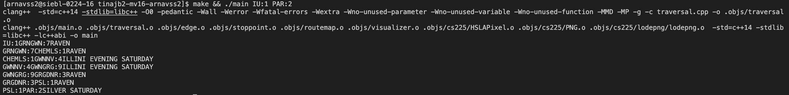

## Final Deliverables

# Discoveries Made
As for interesting things we found, some things we learned were that there are 4711 trips, 1976 bus stops and around 500 bus stops that do not have any routes going through the points in the MTD bus system.
Additionally, the average time to travel between any two adjacent stops is 46.2 seconds. 

In terms of our goals, some things we realized is that some stops don't have any edges or trips going into the stop points. Initially, we thought that we had incorrectly parsed and drawn our edges, 
but it turns out that some stops just did not have any trips go through them. 

# Results 

Our first proposed goal was to find the shortest routes between two given bus stops. We used Dijkstra’s algorithm to find this. The input is the two stops and the output is the list of trips with the shortest path. 

Our other goal was to find the time it takes to travel between two stops and create a visualization of the MTD bus system. Below is the visualization of the bus stops with the trips as the edges. 

Our last goal was to use BFS in order to traverse our graph. The output for this traversal can be seen in bfs.txt in this repository. 

Lastly, to prove the accuracy of our algorithms and graphs, we have a fold of tests that can be run through typing in "make test && ./test" in the terminal. 
